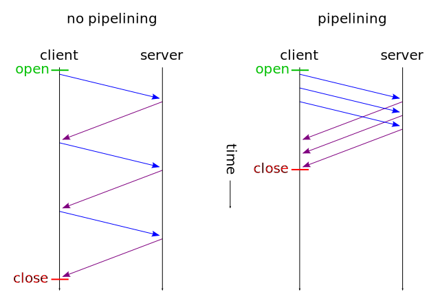

## What is a *true* asynchronous call.
A *true* asynchronous is one that does bounded by client side thread pool.
That is each remote call does not add anther waiting thread in the client instead there is a group of constant size threads that
handles all the read and write regardless of the number of processing calls.

In addition the caller thread should not blocked as well, it can not use as the thread that waiting for the result.

## Asynchronous calls and message pipelining.
Pipelining is a technique in which multiple requests are sent on a single TCP connection without waiting for the corresponding responses.
The pipelining of requests results in a dramatic throughput improvement, especially over high latency connections such as satellite Internet connections.
While it is possible to implement *true* asynchronous calls on top of protocol that does not support pipelining such implementation will have to open
new connection (or to reused unused one) for each call,such systems are less scalable.



## How to implement a *true* asynchronous call.
With pipelining protocol and Java NIO it is not hard to implement a *true* asynchronous calls.
This is because sending message in such system is no more then adding the message data on the queue of the network selector thread,
 and as such it is clearly does not block the calling thread.
The other trick is that each Request should contains a unique request id sent to the server, the server copy this request id to its reply.
This make it possible for the client code to match the response to its request.

Here is how I implemented it in the [AsyncRMI](https://github.com/barakb/asyncrmi) protocol.
After a Request is put on the selector queue the proxy return a [CompletableFuture](https://docs.oracle.com/javase/8/docs/api/java/util/concurrent/CompletableFuture.html) to the caller, this future is
saved in an internal data structure inside the caller proxy and when the matching reply arrives from the server it is resolved with the value from the reply.

<div class="diagram">
    Main->Proxy: invoke foo("bar");
    Proxy->Selector: Request(requestId=1\n,objectId=89, methodId=3\n,params=["bar"])
    Note right of Proxy: Proxy create a future\nf=Future<String> and\nsave it in with the context\nrequestId = 1
    Proxy->Main: return f
    Selector->Server: request
    Server->Selector: response
    Selector->Proxy: Response(requestId=1\n,result="value")
    Note right of Proxy: Proxy resolve f with "value"
</div>

Assuming we have the remote interface:

```java
    public interface RemoteServer extends Remote{
        CompletableFuture<String> call(int index);
    }
```

With *true* asynchronous calls it is possible to write the following client code that use only one user thread
and start processing after the time of the longest call instead of the sum calls durations.

```java
    for(int i = 0; i < 100; ++i){
        client.call(i).thenAccept(value -> store.addResult(value));
    }
    store.waitForAllResults();
    process(store.getResults());
```


